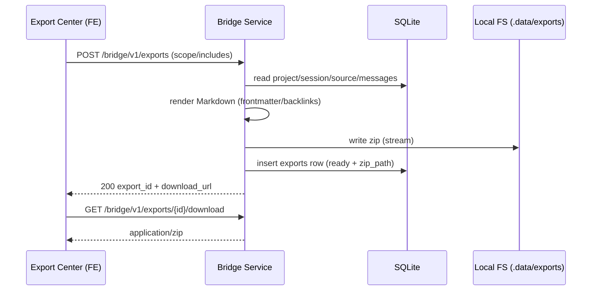

# 50 - Export Center：Export Markdown ZIP（P0）

## 1. 目标（Goal）
- 提供 Export Center 的后端能力：把 AI Learning OS（Bridge/SQLite）里的项目/会话/资产导出为 **Markdown ZIP**。
- ZIP 中的每个 Markdown 文件必须包含 **frontmatter + backlinks**（证据可回跳到 Replay UI）。
- 支持导出历史：可列出、可下载、可复用配置（最小可用）。

## 2. 非目标（Non-goals）
- 不在本 spec 中定义前端页面的 UI 细节（FE 单独实现）。
- 不做双向同步（OpenNotebook 编辑不回写）——发布方向仅为 one-way publish。
- 不强依赖 OpenNotebook 在线可用：即使没部署 OpenNotebook，P0 仍可导出 ZIP。

## 3. 用户故事 / 场景
- 用户在完成一次 Codex 会话后，希望一键导出 ZIP，放进 OpenNotebook/Obsidian 长期沉淀。
- 用户希望保留导出历史，能下载之前的 export-001、export-002。
- 用户在 OpenNotebook 里阅读/追问时，点击 evidence_links / Open in Replay 能回到 Replay UI 定位到 `m-000123`。

## 4. 输入 / 输出
- Input：
  - 导出范围（scope）：project/session/时间窗
  - 导出内容（includes）：Sessions/TechCards/Playbooks/Practices（MVP 允许为空缺但目录结构固定）
  - 隐私策略：默认不包含 tool outputs / environment context；可选 include_raw_jsonl（显式开关）
- Output：
  - 一个可下载 ZIP（以及对应的 ExportBundle 记录）

## 5. 接口与数据格式

### 5.1 API

#### `POST /bridge/v1/exports`（create）
Request（MVP 建议）：
```json
{
  "scope": {
    "project_id": "proj_0001",
    "session_id": "sess_0001"
  },
  "includes": {
    "sessions": true,
    "tech_cards": true,
    "playbooks": true,
    "practices": true
  },
  "include_raw_jsonl": false
}
```

Response（MVP 建议）：
```json
{
  "export_id": "exp_0001",
  "status": "ready",
  "created_at": "2026-01-03T00:00:00Z",
  "download_url": "/bridge/v1/exports/exp_0001/download",
  "warnings": []
}
```

错误响应：使用 `docs/ai-learning-os/SPECS/20-bridge-service-mvp.md` 的 Error 响应结构。

#### `GET /bridge/v1/exports`（list）
Response（MVP 建议）：
```json
{
  "exports": [
    {
      "export_id": "exp_0001",
      "status": "ready",
      "created_at": "2026-01-03T00:00:00Z",
      "scope": { "project_id": "proj_0001", "session_id": "sess_0001" },
      "download_url": "/bridge/v1/exports/exp_0001/download"
    }
  ]
}
```

#### `GET /bridge/v1/exports/{export_id}/download`（download ZIP）
- `Content-Type: application/zip`
- 文件名建议：`export-001.zip`（或 `export-{export_id}.zip`）

### 5.2 ExportBundle（SQLite 记录，建议字段）
- `exports(id, project_id, session_id, status, zip_path, zip_sha256, created_at, error_json)`
- 备注：
  - `zip_path` 应落在 `bridge/.data/exports/`（gitignore）
  - `zip_sha256` 用于去重/校验下载完整性（可选）

### 5.3 ZIP 目录结构（固定）
```
00_Index.md
manifest.json
Sessions/
TechCards/
Playbooks/
Practices/
```

### 5.4 manifest.json（建议）
```json
{
  "version": "v0.3.4",
  "export_id": "exp_0001",
  "created_at": "2026-01-03T00:00:00Z",
  "scope": { "project_id": "proj_0001", "session_id": "sess_0001" },
  "counts": { "sessions": 1, "tech_cards": 0, "playbooks": 0, "practices": 0 },
  "replay": { "base_url": "http://127.0.0.1:7331" }
}
```

### 5.5 Markdown 契约（必须）
以 v0.3.4 文档为准：
- `prd/AI_Learning_OS_PRD_Adult_v0.3.4_NotebookLayer.md`
- `prd/AI_Learning_OS_OpenNotebook_Integration_v0.3.4_zh.md`

最低要求（MVP）：
- frontmatter 必含：`source/version/item_type/project_id/session_id/evidence_links`
- backlinks 必含：`Open in Replay`（指向 `{BRIDGE_PUBLIC_BASE_URL}/replay/...`）

## 6. 关键流程（可用时序图/流程图）



## 7. 错误处理与边界条件
- scope 校验：
  - project_id/session_id 不存在 → 404
  - scope 为空或不合法 → 400
- 体量与性能：
  - 单次导出包含大量会话/消息时，必须避免把全部内容一次性读入内存（ZIP 流式生成）。
  - 需要对单次导出设置软限制（例如 message_count/zip size 上限），超过上限返回 413 或 400 并给出明确提示。
- 安全：
  - ZIP 路径必须防止目录穿越（禁止 `../` 等）。
  - ZIP 内文件名必须稳定且可预测（不要直接使用用户输入作为路径片段）。
  - 导出默认不包含 tool outputs / environment context；`include_raw_jsonl` 必须显式开启并提示风险。
- 证据回跳：
  - 若未配置 `BRIDGE_PUBLIC_BASE_URL`，必须返回 warning（否则导出到 OpenNotebook 后链接不可用）。

## 8. 验收标准（Acceptance Criteria）
- [ ] 能对单个 session 创建 export 并下载 ZIP
- [ ] ZIP 结构符合固定目录结构，且包含 `00_Index.md` + `manifest.json`
- [ ] 导出的 Markdown 含 frontmatter + backlinks，且 `Open in Replay` 可打开 Replay UI
- [ ] 默认不导出 tool outputs / environment context；开启 `include_raw_jsonl` 后才包含原始 JSONL
- [ ] 列表接口能返回导出历史与 download_url

## 9. 运行/调试方式（本地）
- 启动 Bridge：`cd bridge && npm install && npm run dev`
- 创建导出（示例）：`curl -sS -X POST http://127.0.0.1:7331/bridge/v1/exports -H "content-type: application/json" -d @request.json`
- 下载：`curl -L -o export.zip http://127.0.0.1:7331/bridge/v1/exports/exp_0001/download`
