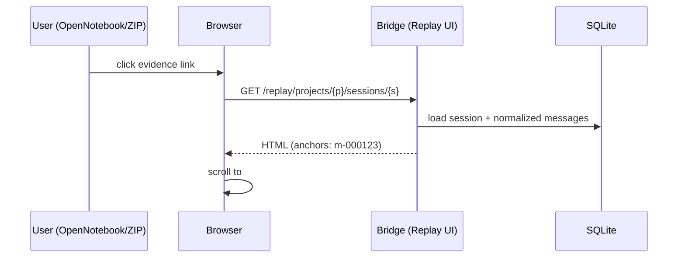

# 60 - Replay UI：Session Transcript Viewer（证据回跳）

> 参考交互：`simonw/claude-code-transcripts`（不复制实现，仅借鉴信息结构与可用性：索引页 + 会话页 + 稳定锚点 + 可分享链接）。

## 1. 目标（Goal）
- 提供 “证据回跳”的最终入口：从 Notes/Assets/ZIP/OpenNotebook 点击链接，能在浏览器中打开 Replay UI 并定位到具体 message（`#m-000123`）。
- Replay URL 必须稳定（可长期引用），并与 Bridge 的 `message_id` 完全一致。
- 支持大体量会话的可读回放：分页/跳转/搜索（MVP 可先做最小可用）。

## 2. 非目标（Non-goals）
- 不做复杂的资产编辑（编辑发生在 AI Learning OS 或 Notebook 内，不在 Replay UI）。
- 不做双向同步与冲突解决。
- 不在 MVP 做用户体系/权限（后续可加）。

## 3. 用户故事 / 场景
- 用户在 OpenNotebook 中阅读 Summary，点击某条 claim 的证据链接 → 打开 Replay UI 并定位到 `m-000123`。
- 用户把导出的 ZIP 分享给自己未来使用，点击 `Open in Replay` 仍能回到本地 Bridge 的会话页。
- 用户需要快速在会话里定位关键词（例如某次报错栈），并复制代码片段。

## 4. 输入 / 输出
- Input：
  - `project_id`
  - `session_id`
  - `message_id`（URL fragment：`#m-000123`）
- Output：
  - HTML 页面（索引页/会话页）
  - （可选）JSON API（供前端渲染/分页）

## 5. 接口与数据格式

### 5.1 Web Routes（稳定契约）
- `GET /replay`
  - 列出 projects / sessions（最小可用：按最近导入排序）
- `GET /replay/projects/{project_id}/sessions/{session_id}`
  - 会话回放页，页面内每条消息带锚点 `id="m-000123"`

### 5.2 Replay deep link（证据回跳最终标准）
- `{BRIDGE_PUBLIC_BASE_URL}/replay/projects/{project_id}/sessions/{session_id}#m-000123`

### 5.3 message_id 规则（必须稳定）
- 格式固定：`m-` + 6 位数字（从 `m-000001` 开始）
- 生成规则以 `docs/ai-learning-os/SPECS/20-bridge-service-mvp.md` 为准（Normalizer 负责）
- 重要约束：同一份会话数据重复导入后，message_id 必须稳定（否则历史 evidence_links 失效）

## 6. 关键流程（可用时序图/流程图）

## 7. 错误处理与边界条件
- 404：
  - project 不存在 / session 不存在 → 返回可读错误页（包含“去哪里导入/同步”的提示）
- 大会话性能：
  - 需要分页/懒加载（例如 query：`?limit=200&offset=0` 或 “load more”）
  - 渲染必须避免一次性输出超大 HTML（否则浏览器卡死）
- 安全：
  - 必须对 message 文本做 HTML 转义，防止 XSS（会话内容可能包含任意字符串）
  - 代码块/Markdown 渲染要可控（MVP 可先纯文本 + pre/code）
- 链接可用性：
  - `BRIDGE_PUBLIC_BASE_URL` 未配置时，仍可在本机点击（相对链接）但发布到 OpenNotebook/ZIP 会失效，需要在生成 evidence_links 时给出 warning。

## 8. 验收标准（Acceptance Criteria）
- [ ] `/replay` 可打开并列出至少最近导入的 sessions
- [ ] 会话页存在稳定锚点：`#m-000123`，且与 evidence_links 一致
- [ ] 从 OpenNotebook/ZIP 点击 evidence_links 能回跳并定位到对应 message
- [ ] 会话页在 500 条消息规模下仍可用（分页/懒加载任一方案）

## 9. 运行/调试方式（本地）
- 启动 Bridge：`cd bridge && npm install && npm run dev`
- 打开浏览器：`http://127.0.0.1:7331/replay`
